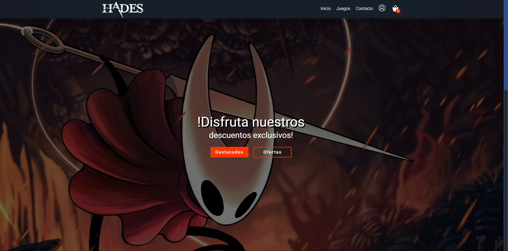
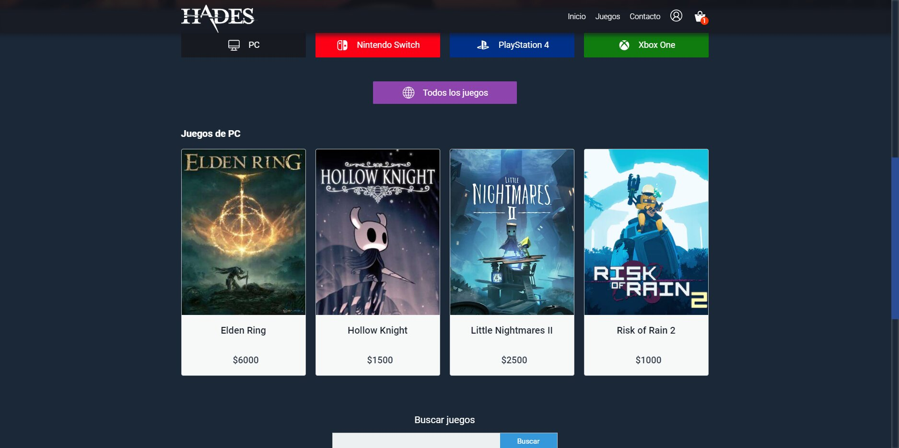
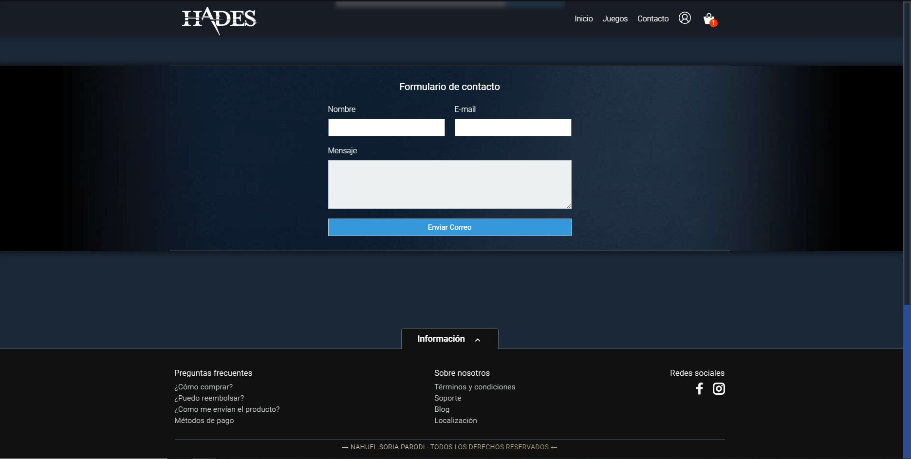

<h1 align="center"> <u> Proyecto final Diplomatura Web FullStack. </u> </h1>

<h1 align="center"> <u> Creado por Nahuel Soria Parodi. </u> </h1>

<h2 align="center"> <u> Tecnologias Utilizadas. </u> </h2>

 

- 
- 
- 
- 
- 
- 

 

<h2 align="center"> <u> Objetivo del proyecto. </u> </h2>

 

<h3> <strong> Crear una tienda de venta de videojuegos. Utilizando diferentes tecnologias para darle funcionalidad, estilo y un formato amigable para el usuario. </strong> </h3>

 

<h2 align="center"> <u> Capturas del proyecto. </u> </h2>

 

<h3 align="center"> <u> Parte principal de la pagina. </u> </h3>

 

 

<h3 align="center"> <u> Juegos disponibles y zona para buscar otros juegos. </u> </h3>

 

 

<h3 align="center"> <u> Formulario de contacto y footer de la pagina. </u> </h3>

 

